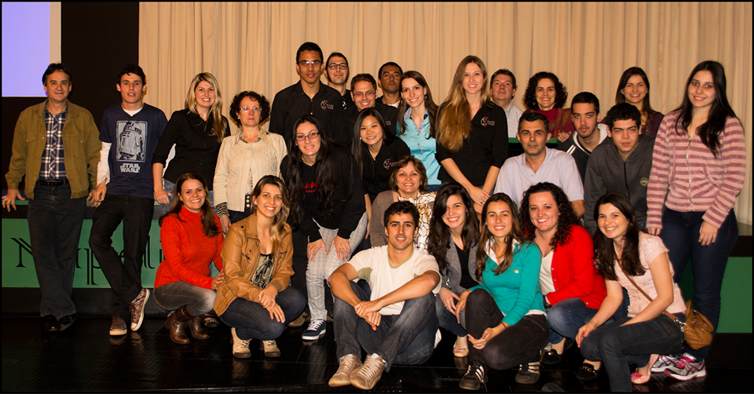

```{r setup, include=FALSE}
options(htmltools.dir.version = FALSE)
knitr::opts_chunk$set(
  fig.width=9, fig.height=3.5, fig.retina=3,
  out.width = "100%",
  cache = FALSE,
  echo = TRUE,
  message = FALSE, 
  warning = FALSE,
  hiline = TRUE
)
```

```{r xaringan-themer, include=FALSE, warning=FALSE}
library(xaringanthemer)
style_duo_accent(
  primary_color = "#BD1C1C",
  secondary_color = "#BD1C1C",
  inverse_header_color = "#FFFFFF",
  base_font_size = "30px",
  title_slide_background_image = 'img/simbolo.png',
  title_slide_background_size = "120px" ,
  title_slide_background_position = '100% 97%'
  )
```

class: inverse center middle

# Sobre a Estats Consultoria

---

background-image: url("img/fundo_slide.png")  
background-size: contain

## .right[O que é uma empresa júnior?]

Uma Empresa Júnior é uma associação sem fins lucrativos que visa o
desenvolvimento profissional e humano de seus membros, através da
execução de projetos em que são aplicadas as teorias ministradas em sala
de aula.

---

background-image: url("img/fundo_slide.png")  
background-size: contain

## .right[A Estats Consultoria]

- Idealizada por 2 alunas, a coordenadora e o vice da época;

--
- Visava que o aluno criasse uma postura profissional e saísse preparado para o mercado;

--
- Fundada em 30 de Julho de 2013.

---

background-image: url("img/fundo_slide.png")  
background-size: contain

## .right[A Estats Consultoria]
```{r, out.width="65%", fig.align = 'center', echo=FALSE}

```
---

background-image: url("img/fundo_slide.png")  
background-size: contain

## .right[Estrutura Organizacional]

--
- Presidente: Lucas 
--

- Vice Presidente: Lorival
--

- Conselheira Executiva: Maria Eduarda
--

- Diretora de Desenvolvimento Humano e Organizacional: Giovanna
--

- Diretora Juridico-Financeiro: Débora
--

- Diretor de Projetos: Gabriel
--

- Diretor de Marketing: Julio

---

background-image: url("img/fundo_slide.png")  
background-size: contain

## .right[Numar]


--
- Numar (Núcleo das Empresas Juniores de Maringá e Jandaia do Sul)

--


Premiações do Segundo Semestre

--
- EJ Navegando em Águas Profundas.


--
- EJ Mar Aberto.


---

background-image: url("img/fundo_slide.png")  
background-size: contain

## .right[Numar]
```{r, out.width="59%", fig.align = 'center', echo=FALSE}
knitr::include_graphics("img/numar.jpg" )
```
---
class: inverse center middle

# Consultorias

---

background-image: url("img/fundo_slide.png")  
background-size: contain

## .right[O que é uma consultoria?]

--
<br><br>


---

background-image: url("img/fundo_slide.png")  
background-size: contain

## .right[O processo de uma consultoria]

<br><br>
- Chegada do cliente;
- Negociação;
- Prestação de serviços;
- Pós-vendas.

---
background-image: url("img/fundo_slide.png")  
background-size: contain


## .right[Consultoria odontologia]

Objetivo: Verificação de concordância entre medições e comparação da densidade de determinados ossos nos lados direitos e esquerdo entre dois grupos - afetado e controle.

- Doenças: anemia falciforme e beta-talassemia
- Metodologia: ICC, testes de normalidade, Mann-whitney e teste t

---

background-image: url("img/fundo_slide.png")  
background-size: contain

## .right[Consultoria odontologia]

**Conclusões**

- Nos dois tempos, as medidas eram concordantes.
- No grupo afetado havia diferença entre lado esquerdo e direito
- No grupo controle não houve diferença na densidade entre os lados
- Comparando um grupo com outro, havia diferença entre os lados esquerdos


---

background-image: url("img/fundo_slide.png")  
background-size: contain

## .right[Consultoria Covid-19]

Objetivo: Compreender se os graus do Covid (Leve e Grave) influenciam nas avaliações testadas e se essas podem ser usadas para entender o grau da doença.

- Sobre as avaliações: Havia alguma de memória, algumas de cordenação motora e avaliação de histórico médico.
- Metodologia: normalidade, qui-quadrado e regressão logística.

---
background-image: url("img/fundo_slide.png")  
background-size: contain

## .right[Consultoria Covid-19]

**Problemas**

- Problemas de amostragem: Amostra pequena e muito heterogênea quanto a idade e escolaridade
- Problemas nos escores: Concentração da pontuação dos escores no máximo

---

background-image: url("img/fundo_slide.png")  
background-size: contain

## .right[Consultoria Covid-19]

**Conclusões**

- No Qui-quadrado verificamos o grau do covid e a classificação em cada teste era independente.
- Na regressão utilizando o grau do covid como variável independente verificamos que a única variável significativa do banco foi a idade.

---

background-image: url("img/fundo_slide.png")  
background-size: contain

## .right[Consultoria economia]

Objetivo: Queria verificar se as escolas que eram de gerência estadual e foram para gerência municipal melhoravam ou pioravam.
- Medida usada: Nota do SAEB 2011 - 2021
- Metodologia: Diferenças de diferenças em múltiplos períodos de tempo

---
background-image: url("img/fundo_slide.png")  
background-size: contain

## .right[Consultoria economia]

**Problemas**

- Pesquisa SAEB: Realizada por amostragem;
- Múltiplos períodos de tempo;
- Metodologia criada no final de 2020;
- Consistência do banco de dados.

---

class: inverse center middle

# Conclusão

---

class: inverse

##.center[Obrigado pela atenção]

.pull-left[
Onde nos encontrar:
<BR><BR>
```{r, echo=FALSE, out.width="70%"}
  
```
]

.pull-right[
<br>
```{r, echo=FALSE, out.width="40px"}
  
```
@estatsej
 <br><br>
```{r, echo=FALSE, out.width="40px"}
  
```
 estats.ej@gmail.com
 <br><br>
```{r, echo=FALSE, out.width="40px"}
  
```
 <font color = "#FFFFFF"> www.estatsej.com.br </font>
 <br><br>
```{r, echo=FALSE, out.width="40px"}
  
```
 Sala 18, bloco E90 - UEM
 

]